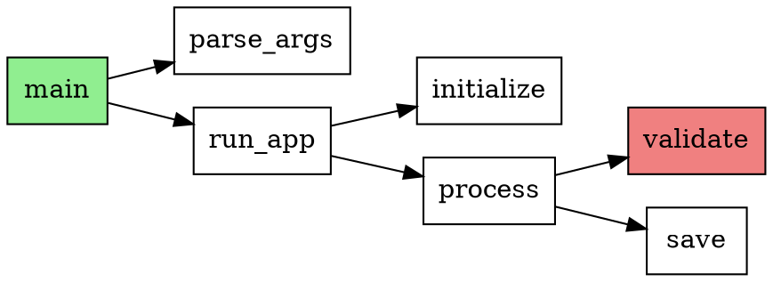

# Design: Intelligent Code-Aware Veiling

**Status**: Draft  
**Scope**: Rust, TypeScript, Python (Priority Languages)  
**Constraint**: Pure Rust Dependencies Only (no external binaries, no system programs)

---

## 1. Goals

Enable `funveil` to understand code structure and automatically veil/hide code based on semantic meaning rather than just file paths. This helps LLMs focus on relevant code by:

1. Showing only function/class signatures (hiding implementations)
2. Tracing call graphs from entrypoints
3. Following data flow through the codebase
4. Providing "task-aware" code revelation

---

## 2. Constraints & Principles

### 2.1 Pure Rust Dependencies

**Allowed**:
- Crates from crates.io that compile entirely via Cargo
- C code compiled via `build.rs` + `cc` crate (tree-sitter parsers)
- Pure Rust implementations

**Forbidden**:
- Spawning external processes (LSP servers, git, shell commands)
- System library dependencies (requires `apt install` or similar)
- Dynamic linking to non-Rust libraries

**Rationale**: Zero setup friction. `cargo install funveil` should work on any system with just Rust toolchain.

### 2.2 Tree-Sitter vs LSP

We use **Tree-sitter only**, not LSP, because:
- LSP requires external language server binaries (violates pure Rust constraint)
- Tree-sitter parsers are Rust crates with embedded C grammars
- Tree-sitter is error-resilient (works on incomplete/syntax-error files)
- Sufficient for structural analysis (functions, classes, calls)

### 2.3 Languages (Priority Order)

1. **Rust** - Dogfooding (funveil is written in Rust)
2. **TypeScript** - Large ecosystem, widely used
3. **Python** - Dominant in AI/ML, popular with LLMs

Future: Java, Zig, Bash (lower priority)

---

## 3. Architecture

```
┌─────────────────────────────────────────────────────────────┐
│                        CLI Layer                            │
│  fv veil --mode headers                                     │
│  fv trace --from calculate_sum --depth 2                    │
│  fv entrypoints                                             │
└─────────────────────────────────────────────────────────────┘
                              │
┌─────────────────────────────────────────────────────────────┐
│                    Strategy Layer                           │
│  HeaderStrategy, EntrypointStrategy, TraceStrategy          │
└─────────────────────────────────────────────────────────────┘
                              │
┌─────────────────────────────────────────────────────────────┐
│                    Analysis Layer                           │
│  CallGraphBuilder, DataflowAnalyzer, EntrypointDetector     │
└─────────────────────────────────────────────────────────────┘
                              │
┌─────────────────────────────────────────────────────────────┐
│                    Parser Layer                             │
│  TreeSitterParser, LanguageDetector, QueryEngine            │
│  (tree-sitter-rust, tree-sitter-typescript,                 │
│   tree-sitter-python)                                       │
└─────────────────────────────────────────────────────────────┘
```

---

## 4. Component Design

### 4.1 Parser Layer (`src/parser/`)

#### Dependencies

```toml
[dependencies]
tree-sitter = "0.20"
tree-sitter-rust = "0.20"
tree-sitter-typescript = "0.20"
tree-sitter-python = "0.20"
```

All are pure Rust crates with embedded C parsers compiled via `build.rs`.

#### Language Detection

```rust
pub enum Language {
    Rust,
    TypeScript,
    Python,
    Unknown,
}

pub fn detect_language(path: &Path) -> Language {
    match path.extension().and_then(|e| e.to_str()) {
        Some("rs") => Language::Rust,
        Some("ts") | Some("tsx") => Language::TypeScript,
        Some("py") | Some("pyi") => Language::Python,
        _ => Language::Unknown,
    }
}
```

#### AST Extraction

```rust
pub struct ParsedFile {
    pub language: Language,
    pub path: PathBuf,
    pub symbols: Vec<Symbol>,
    pub imports: Vec<Import>,
    pub calls: Vec<Call>,
}

pub enum Symbol {
    Function {
        name: String,
        params: Vec<Param>,
        return_type: Option<String>,
        line_range: LineRange,
        body_range: LineRange,  // For veiling
    },
    Class {
        name: String,
        methods: Vec<Symbol>,
        properties: Vec<Property>,
        line_range: LineRange,
    },
    // ...
}

pub struct Call {
    pub caller: Option<String>,  // None for top-level
    pub callee: String,
    pub line: usize,
    pub is_dynamic: bool,  // true for callbacks, function pointers
}
```

#### Tree-sitter Queries

Queries are stored as `&'static str` in Rust source files (embedded), not external `.scm` files.

**Example: Extract Functions (Rust)**

```rust
const RUST_FUNCTION_QUERY: &str = r#"
[
  (function_item
    name: (identifier) @func.name
    parameters: (parameters) @func.params
    return_type: (_)? @func.return
    body: (block) @func.body) @func.def
  
  (function_signature_item
    name: (identifier) @func.name
    parameters: (parameters) @func.params
    return_type: (_)? @func.return) @func.sig
]
"#;
```

**Example: Extract Functions (TypeScript)**

```rust
const TS_FUNCTION_QUERY: &str = r#"
[
  (function_declaration
    name: (identifier) @func.name
    parameters: (formal_parameters) @func.params
    return_type: (type_annotation)? @func.return
    body: (statement_block) @func.body) @func.def
  
  (method_definition
    name: (property_identifier) @func.name
    parameters: (formal_parameters) @func.params
    return_type: (type_annotation)? @func.return
    body: (statement_block) @func.body) @func.def
  
  (arrow_function
    parameters: (_) @func.params
    return_type: (type_annotation)? @func.return
    body: (_) @func.body) @func.def
]
"#;
```

**Example: Extract Functions (Python)**

```rust
const PYTHON_FUNCTION_QUERY: &str = r#"
(function_definition
  name: (identifier) @func.name
  parameters: (parameters) @func.params
  return_type: (type)? @func.return
  body: (block) @func.body) @func.def
"#;
```

#### Implementation

```rust
pub struct TreeSitterParser {
    parsers: HashMap<Language, tree_sitter::Parser>,
    queries: HashMap<Language, tree_sitter::Query>,
}

impl TreeSitterParser {
    pub fn new() -> Result<Self> {
        // Initialize parsers for each language
        let mut parsers = HashMap::new();
        let mut queries = HashMap::new();
        
        // Rust
        let mut rust_parser = tree_sitter::Parser::new();
        rust_parser.set_language(tree_sitter_rust::language())?;
        parsers.insert(Language::Rust, rust_parser);
        queries.insert(Language::Rust, tree_sitter::Query::new(
            tree_sitter_rust::language(),
            RUST_FUNCTION_QUERY,
        )?);
        
        // TypeScript
        let mut ts_parser = tree_sitter::Parser::new();
        ts_parser.set_language(tree_sitter_typescript::language_typescript())?;
        parsers.insert(Language::TypeScript, ts_parser);
        queries.insert(Language::TypeScript, tree_sitter::Query::new(
            tree_sitter_typescript::language_typescript(),
            TS_FUNCTION_QUERY,
        )?);
        
        // Python
        let mut py_parser = tree_sitter::Parser::new();
        py_parser.set_language(tree_sitter_python::language())?;
        parsers.insert(Language::Python, py_parser);
        queries.insert(Language::Python, tree_sitter::Query::new(
            tree_sitter_python::language(),
            PYTHON_FUNCTION_QUERY,
        )?);
        
        Ok(Self { parsers, queries })
    }
    
    pub fn parse_file(&self, path: &Path, content: &str) -> Result<ParsedFile> {
        let lang = detect_language(path);
        let parser = self.parsers.get(&lang)
            .ok_or_else(|| Error::UnsupportedLanguage(lang))?;
        
        let tree = parser.parse(content, None)
            .ok_or_else(|| Error::ParseFailed)?;
        
        let query = self.queries.get(&lang)
            .ok_or_else(|| Error::UnsupportedLanguage(lang))?;
        
        let mut cursor = tree_sitter::QueryCursor::new();
        let matches = cursor.matches(query, tree.root_node(), content.as_bytes());
        
        let mut symbols = Vec::new();
        for m in matches {
            if let Some(symbol) = self.extract_symbol(&m, content)? {
                symbols.push(symbol);
            }
        }
        
        Ok(ParsedFile {
            language: lang,
            path: path.to_path_buf(),
            symbols,
            imports: self.extract_imports(tree.root_node(), content, lang)?,
            calls: self.extract_calls(tree.root_node(), content, lang)?,
        })
    }
}
```

---

### 4.2 Analysis Layer (`src/analysis/`)

#### Call Graph Builder

Builds an in-memory call graph using `petgraph` (pure Rust graph library).

```rust
use petgraph::graph::{DiGraph, NodeIndex};

pub struct CallGraph {
    graph: DiGraph<Symbol, ()>,
    symbol_indices: HashMap<String, NodeIndex>,
}

impl CallGraph {
    pub fn build_from_files(files: &[ParsedFile]) -> Self {
        let mut graph = DiGraph::new();
        let mut symbol_indices = HashMap::new();
        
        // Add all symbols as nodes
        for file in files {
            for symbol in &file.symbols {
                let full_name = format!("{}::{}", file.path.display(), symbol.name());
                let idx = graph.add_node(symbol.clone());
                symbol_indices.insert(full_name, idx);
            }
        }
        
        // Add edges for calls
        for file in files {
            for call in &file.calls {
                if let Some(callee_idx) = symbol_indices.get(&call.callee) {
                    // Find caller symbol
                    if let Some(caller) = &call.caller {
                        let caller_name = format!("{}::{}", file.path.display(), caller);
                        if let Some(caller_idx) = symbol_indices.get(&caller_name) {
                            graph.add_edge(*caller_idx, *callee_idx, ());
                        }
                    }
                }
            }
        }
        
        Self { graph, symbol_indices }
    }
    
    pub fn trace_forward(&self, symbol: &str, depth: usize) -> Vec<Vec<&Symbol>> {
        // BFS traversal up to depth
        // Returns paths from start symbol
    }
    
    pub fn trace_backward(&self, symbol: &str, depth: usize) -> Vec<Vec<&Symbol>> {
        // Reverse BFS (who calls this function)
    }
    
    pub fn find_entrypoints(&self) -> Vec<&Symbol> {
        // Nodes with no incoming edges (or specific patterns like main())
    }
}
```

#### Entrypoint Detector

Identifies program entrypoints without external tools.

```rust
pub struct EntrypointDetector;

impl EntrypointDetector {
    pub fn detect(file: &ParsedFile) -> Vec<&Symbol> {
        match file.language {
            Language::Rust => Self::detect_rust(file),
            Language::TypeScript => Self::detect_typescript(file),
            Language::Python => Self::detect_python(file),
            _ => vec![],
        }
    }
    
    fn detect_rust(file: &ParsedFile) -> Vec<&Symbol> {
        file.symbols.iter()
            .filter(|s| matches!(s, Symbol::Function { name, .. } if name == "main"))
            .chain(
                // #[test] functions
                file.symbols.iter()
                    .filter(|s| s.has_attribute("test"))
            )
            .collect()
    }
    
    fn detect_typescript(file: &ParsedFile) -> Vec<&Symbol> {
        // Look for:
        // - Exported functions that aren't imported elsewhere
        // - CLI entry patterns
        file.symbols.iter()
            .filter(|s| s.is_exported() && !s.is_imported_elsewhere())
            .collect()
    }
    
    fn detect_python(file: &ParsedFile) -> Vec<&Symbol> {
        // Look for:
        // - `if __name__ == "__main__":` blocks
        // - Scripts with top-level code
        file.symbols.iter()
            .filter(|s| matches!(s, Symbol::Function { name, .. } if name == "main"))
            .collect()
    }
}
```

#### Code Index (Cross-File Analysis)

Builds an index of all symbols across the codebase for cross-file analysis.

```rust
pub struct CodeIndex {
    pub files: HashMap<PathBuf, ParsedFile>,
    pub symbol_table: HashMap<String, Vec<SymbolLocation>>, // "func_name" -> [loc1, loc2]
    pub import_graph: ImportGraph,
}

pub struct SymbolLocation {
    pub file: PathBuf,
    pub line_range: LineRange,
    pub symbol: Symbol,
}

impl CodeIndex {
    pub fn build(root: &Path, parser: &TreeSitterParser) -> Result<Self> {
        let mut files = HashMap::new();
        let mut symbol_table: HashMap<String, Vec<SymbolLocation>> = HashMap::new();
        
        // Find all source files
        let source_files = Self::find_source_files(root)?;
        
        // Parse all files (parallel with rayon)
        let parsed: Vec<_> = source_files
            .par_iter()  // Parallel iteration
            .filter_map(|path| {
                let content = fs::read_to_string(path).ok()?;
                parser.parse_file(path, &content).ok().map(|p| (path.clone(), p))
            })
            .collect();
        
        // Build index
        for (path, parsed_file) in parsed {
            for symbol in &parsed_file.symbols {
                let name = symbol.full_name(); // Include module path for qualified names
                let location = SymbolLocation {
                    file: path.clone(),
                    line_range: symbol.line_range(),
                    symbol: symbol.clone(),
                };
                symbol_table.entry(name).or_default().push(location);
            }
            files.insert(path, parsed_file);
        }
        
        Ok(Self {
            files,
            symbol_table,
            import_graph: ImportGraph::build(&files),
        })
    }
    
    pub fn find_symbol(&self, name: &str) -> Option<&Vec<SymbolLocation>> {
        // Try exact match first
        if let Some(locations) = self.symbol_table.get(name) {
            return Some(locations);
        }
        
        // Try unqualified name (last segment)
        let unqualified = name.split("::").last()?;
        self.symbol_table.get(unqualified)
    }
    
    pub fn resolve_call(&self, call: &Call, caller_file: &Path) -> Option<&Symbol> {
        // Try to find the target of a function call
        // 1. Check imports in caller_file
        // 2. Check local definitions
        // 3. Check global symbol table
        let caller = self.files.get(caller_file)?;
        
        // Check if callee is imported
        if let Some(import) = caller.imports.iter().find(|i| i.alias == call.callee) {
            // Resolve imported symbol
            return self.find_symbol(&import.full_path)
                .and_then(|locs| locs.first())
                .map(|loc| &loc.symbol);
        }
        
        // Check local to file
        if let Some(symbol) = caller.symbols.iter().find(|s| s.name() == call.callee) {
            return Some(symbol);
        }
        
        // Global lookup
        self.find_symbol(&call.callee)
            .and_then(|locs| locs.first())
            .map(|loc| &loc.symbol)
    }
}
```

---

### 4.3 Strategy Layer (`src/strategies/`)

Each strategy implements a veiling approach.

#### Header Strategy

Shows only function/class signatures, hides bodies.

```rust
pub struct HeaderStrategy;

impl VeilStrategy for HeaderStrategy {
    fn veil_file(&self, content: &str, parsed: &ParsedFile) -> String {
        let mut result = String::new();
        let mut last_end = 0;
        
        for symbol in &parsed.symbols {
            match symbol {
                Symbol::Function { line_range, body_range, .. } => {
                    // Add content before function
                    result.push_str(&content[last_end..line_range.start()]);
                    
                    // Add signature
                    let signature = &content[line_range.start()..body_range.start()];
                    result.push_str(signature.trim_end());
                    
                    // Add placeholder
                    let body_lines = body_range.len();
                    result.push_str(&format!(" {{ ... {} lines ... }}\n", body_lines));
                    
                    last_end = line_range.end();
                }
                Symbol::Class { line_range, methods, .. } => {
                    // Add class declaration
                    result.push_str(&content[last_end..line_range.start()]);
                    result.push_str("class {} {{\n");
                    
                    // Add method signatures only
                    for method in methods {
                        if let Symbol::Function { name, params, return_type, .. } = method {
                            result.push_str(&format!(
                                "    fn {}({}){};\n",
                                name,
                                params.join(", "),
                                return_type.as_deref().unwrap_or("")
                            ));
                        }
                    }
                    
                    result.push_str("}\n");
                    last_end = line_range.end();
                }
            }
        }
        
        // Add remaining content
        result.push_str(&content[last_end..]);
        result
    }
}
```

#### Entrypoint Strategy

Shows entrypoints fully, their direct callers as headers, hides everything else.

```rust
pub struct EntrypointStrategy<'a> {
    call_graph: &'a CallGraph,
}

impl<'a> VeilStrategy for EntrypointStrategy<'a> {
    fn veil_file(&self, content: &str, parsed: &ParsedFile) -> String {
        let entrypoints = EntrypointDetector::detect(parsed);
        
        // Build set of "relevant" symbols
        let mut relevant = HashSet::new();
        for ep in entrypoints {
            relevant.insert(ep.full_name());
            
            // Add direct callers (1 level up)
            for caller in self.call_graph.direct_callers(&ep.full_name()) {
                relevant.insert(caller.full_name());
            }
        }
        
        // Veil based on relevance
        // ... (similar to HeaderStrategy but with relevance check)
    }
}
```

---

## 5. CLI Interface

### New Commands

```bash
# Veil modes
fv veil --mode headers src/                    # Show only signatures
fv veil --mode entrypoints src/                # Show entrypoints + callers
fv trace --from calculate_sum --depth 2 src/   # Show call tree
fv trace --to process_payment --depth 3 src/   # Show reverse call tree

# Analysis with multiple output formats
fv analyze --entrypoints src/                           # List entrypoints
fv analyze --call-graph --format dot -o graph.dot       # Graphviz DOT
fv analyze --call-graph --format json -o graph.json     # JSON export
fv analyze --export markdown -o api.md                  # Markdown docs

# Smart veiling (experimental)
fv smart-veil --context "fix auth bug" src/    # Heuristic-based veiling
```

### Output Format Details

#### Graphviz DOT (`--format dot`)

For visualizing call graphs:



Usage: `dot -Tpng graph.dot -o graph.png`

#### JSON (`--format json`)

For integration with external tools:

```json
{
  "version": "1.0",
  "generated_at": "2026-03-07T12:00:00Z",
  "files": [
    {
      "path": "src/main.rs",
      "language": "rust",
      "symbols": [
        {
          "kind": "function",
          "name": "calculate_sum",
          "full_name": "src/main.rs::calculate_sum",
          "line_range": [10, 25],
          "signature": "fn calculate_sum(numbers: &[i32]) -> i32",
          "calls": ["std::iter::Iterator::sum"],
          "called_by": ["main"]
        }
      ]
    }
  ],
  "call_graph": {
    "nodes": ["main", "calculate_sum", "validate_input"],
    "edges": [
      {"from": "main", "to": "calculate_sum"},
      {"from": "main", "to": "validate_input"}
    ]
  },
  "entrypoints": ["main", "tests::test_sum"]
}
```

#### Markdown (`--format markdown`)

For documentation generation:

```markdown
# API Documentation

## Module: `src/main.rs`

### Functions

#### `calculate_sum(numbers: &[i32]) -> i32`
- **Lines**: 10-25
- **Called by**: `main`
- **Calls**: `std::iter::Iterator::sum`

```rust
fn calculate_sum(numbers: &[i32]) -> i32 {
    // ... 15 lines ...
}
```

### Entrypoints

- `fn main()` - Application entrypoint (line 3)
```

This is useful for:
- Code review summaries
- Onboarding documentation  
- LLM context preparation

### Configuration

Add to `.funveil_config`:

```yaml
intelligent_veiling:
  languages:
    - rust
    - typescript
    - python
  
  header_mode:
    include_docstrings: true
    max_signature_length: 120
  
  trace_mode:
    default_depth: 3
    include_stdlib: false
  
  entrypoint_detection:
    rust:
      - "main"
      - "#[test]"
    python:
      - "__main__"
      - "cli"
```

---

## 6. Implementation Plan

### Phase 1: Foundation ✅ COMPLETE

**Goal**: Parse Rust, TypeScript, Python and extract basic structure.

**Status**: MERGED (PR #12)

**Implemented**:
- ✅ Added tree-sitter dependencies (`tree-sitter`, `tree-sitter-rust`, `tree-sitter-typescript`, `tree-sitter-python`)
- ✅ Created `src/parser/mod.rs` with language detection
- ✅ Implemented `TreeSitterParser` struct with queries for all 3 languages
- ✅ Created `ParsedFile`, `Symbol`, `CodeIndex` structs
- ✅ Extract functions with params, return types, visibility
- ✅ Extract classes/structs/traits
- ✅ Extract imports and function calls
- ✅ Added `ParseError` to error handling
- ✅ Added tests for parsing

**Files Created**:
- `src/parser/mod.rs` - Parser module with core types
- `src/parser/tree_sitter_parser.rs` - Tree-sitter implementation

**API Usage**:
```rust
use funveil::parser::TreeSitterParser;

let parser = TreeSitterParser::new()?;
let parsed = parser.parse_file(Path::new("src/main.rs"), content)?;

for func in parsed.functions() {
    println!("{}", func.signature());
}
```

### Phase 2: Header Mode ✅ COMPLETE

**Goal**: Implement `--mode headers` veiling.

**Status**: Complete with CLI integration

**Implemented**:
- ✅ Created `src/strategies/mod.rs` with `VeilStrategy` trait
- ✅ Created `src/strategies/header.rs` with `HeaderStrategy`
- ✅ Added `HeaderConfig` for customization options
- ✅ Implemented `format_function()` - shows signature + body placeholder
- ✅ Implemented `format_class()` - shows class with methods/properties
- ✅ Added utility functions (`get_line()`, `get_lines()`)
- ✅ CLI integration: `fv veil <file> --mode headers`
- ✅ Added `fv parse <file>` command for debugging
- ✅ Tests for header strategy

**Files Created/Modified**:
- `src/strategies/mod.rs` - Strategy trait and utilities
- `src/strategies/header.rs` - HeaderStrategy implementation
- `src/main.rs` - Added `--mode` flag to veil command, added `parse` command
- `src/lib.rs` - Export new types

**Usage**:
```bash
# Veil a file showing only headers
fv veil src/main.rs --mode headers

# Parse and inspect a file
fv parse src/main.rs
fv parse src/main.rs --format detailed
```

**Example Output**:
```rust
// Before:
fn calculate_sum(numbers: &[i32]) -> i32 {
    numbers.iter().sum()
}

// After header mode:
fn calculate_sum(numbers: &[i32]) -> i32 { ... 2 lines ... }
```

### Phase 3: Call Graph (Week 4-5)

**Goal**: Build and traverse call graphs.

**Tasks**:
1. Add `petgraph` dependency
2. Implement `CallGraphBuilder`
3. Write tree-sitter queries for call expressions
4. Implement `trace-forward` and `trace-backward` commands
5. Add depth limiting and cycle detection

**Deliverable**: `fv trace --from func --depth 2` shows call tree

### Phase 4: Entrypoints (Week 6)

**Goal**: Detect and work with entrypoints.

**Tasks**:
1. Implement `EntrypointDetector` for each language
2. Create `EntrypointStrategy`
3. Add `fv analyze --entrypoints` command
4. Integrate with trace command

**Deliverable**: Entrypoint detection works for all 3 languages

### Phase 5: Caching & Polish (Week 7)

**Goal**: Add caching and integrate with existing features.

**Tasks**:
1. Add caching layer:
   - Create `src/analysis/cache.rs`
   - Use `bincode` for binary serialization
   - Store in `.funveil/analysis/index.bin`
   - Implement mtime + hash invalidation
   
2. Add intelligent veiling config to `.funveil_config`

3. Integrate with checkpoint system:
   - Cache is invalidated on checkpoint restore
   - Or cache is per-checkpoint

4. Performance optimization:
   - Parallel file parsing with `rayon`
   - Incremental updates

**Deliverable**: 
- Cache works correctly (invalidates on change)
- 10k file codebase parses in reasonable time
- All tests pass

---

## 7. Dependencies

### Required

```toml
[dependencies]
# Core parsing
tree-sitter = "0.20"
tree-sitter-rust = "0.20"
tree-sitter-typescript = "0.20"
tree-sitter-python = "0.20"

# Graph algorithms (pure Rust)
petgraph = "0.6"

# Caching
bincode = "1.3"       # Binary serialization
rayon = "1.8"         # Parallel processing (optional but recommended)

# Existing funveil deps...
```

### Dev Dependencies

```toml
[dev-dependencies]
# Sample code for testing
tempfile = "3.8"
```

### Dependency Analysis

| Crate | Size | Build Time | Notes |
|-------|------|------------|-------|
| tree-sitter | Small | Fast | Core parser lib |
| tree-sitter-rust | Medium | Medium | Embedded C grammar |
| tree-sitter-typescript | Medium | Medium | Embedded C grammar |
| tree-sitter-python | Small | Fast | Embedded C grammar |
| petgraph | Small | Fast | Pure Rust |

**Total additional compile time**: ~10-15 seconds (one-time)
**Runtime overhead**: Minimal (parsing happens during veiling)

---

## 8. Testing Strategy

### Unit Tests

- Parse sample files for each language
- Verify symbol extraction accuracy
- Test call graph construction

### Integration Tests

- Veil real open-source projects:
  - Rust: ripgrep, fd
  - TypeScript: some npm package
  - Python: requests, flask
- Verify output compiles/runs

### Sample Files

Create `tests/samples/`:
- `rust_sample.rs` - Various function types, traits, impl blocks
- `typescript_sample.ts` - Classes, interfaces, generics
- `python_sample.py` - Functions, classes, decorators

---

- Verdict: Not feasible
## 9. Decisions Made

| Question | Decision | Notes |
|----------|----------|-------|
| **Cross-file analysis** | ✅ Parse all files, build `CodeIndex` | Map symbol names to all locations |
| **Generics/Type Parameters** | ✅ Show full generics | `fn process<T: Serialize>(data: T) -> Result<T>` |
| **Caching** | ✅ Yes, cache in `.funveil/analysis/` | `bincode` serialization, mtime+hash invalidation |
| **Macros (Rust)** | ✅ Unexpanded is acceptable | Tree-sitter sees pre-expansion |
| **Output formats** | ✅ DOT + JSON + Markdown | Visualization, integration, documentation |
| **Performance** | ✅ Soft target | Correctness first, optimize later |

### Current Implementation Status

| Component | Status | Notes |
|-----------|--------|-------|
| Tree-sitter foundation | ✅ COMPLETE | All 3 languages parsing |
| Header Mode | ✅ COMPLETE | `fv veil --mode headers` works |
| Parse Command | ✅ COMPLETE | `fv parse <file>` for debugging |
| Call Graph | ⏳ PENDING | Phase 3 |
| Entrypoint Detection | ⏳ PENDING | Phase 4 |
| Caching | ⏳ PENDING | Phase 5 |
| DOT Output | ⏳ PENDING | Phase 5 |
| JSON Output | ⏳ PENDING | Phase 5 |
| Markdown Output | ⏳ PENDING | Phase 5 |

**Current Test Count**: 41 tests passing
- 21 unit tests (parser + strategies)
- 6 CLI tests
- 14 integration tests

### Output Formats Rationale

- **DOT**: Essential for understanding call graph structure visually
- **JSON**: Enables integration with external tools (CI pipelines, custom scripts)
- **Markdown**: Self-documenting codebase exports for README/PR descriptions

### Remaining Open Questions

1. **Dynamic dispatch**: How to represent trait objects, function pointers in call graph?
   - Option: Dotted lines for "may call" relationships
   - Option: Skip dynamic calls in v1

2. **Module paths**: Include full module path in symbol name or just function name?
   - Rust: `crate::module::submodule::function_name`
   - TypeScript: `module/submodule.function_name`
   - Python: `module.submodule.function_name`

---

## 10. Success Criteria

- [ ] Can parse Rust, TypeScript, Python with >95% accuracy
- [ ] Header mode reduces code volume by 60-80%
- [ ] Trace command works up to depth 5
- [ ] Entrypoint detection finds >90% of actual entrypoints
- [ ] No external dependencies required (pure Rust)
- [ ] Performance: Parse 1000 files in <5 seconds (soft target)

---

## Appendix A: Tree-sitter Resources

- Tree-sitter docs: https://tree-sitter.github.io/tree-sitter/
- Query syntax: https://tree-sitter.github.io/tree-sitter/using-parsers#query-syntax
- Rust bindings: https://docs.rs/tree-sitter/latest/tree_sitter/

## Appendix B: Alternative Approaches Considered

### LSP (Rejected)
- Pros: Accurate cross-file analysis, type information
- Cons: Requires external language server binaries
- Verdict: Violates pure Rust constraint

### libclang (Rejected)
- Pros: Accurate C/C++/Rust (via clangd) parsing
- Cons: Requires libclang system library
- Verdict: Violates pure Rust constraint

### PEG Parsers (Rejected)
- Pros: Pure Rust, easy to write
- Cons: Slower, less error-resilient than tree-sitter
- Verdict: Tree-sitter is industry standard for code

### Custom Parsers (Rejected)
- Pros: Full control
- Cons: Massive effort, 3 languages = years of work
- Verdict: Not feasible
